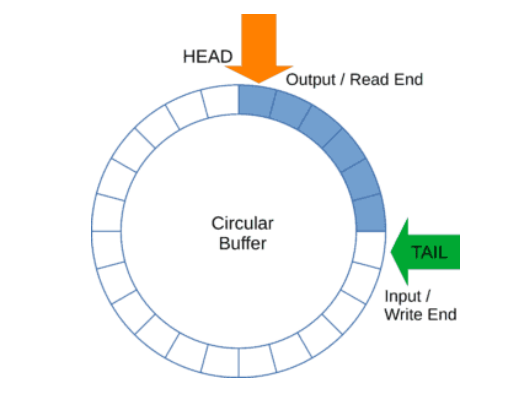

# Esercizio 3 - Buffer Circolare

## Obiettivi:
- tipi complessi generici
- tratti Index e Deref
- analizzare il comportamento del borrow checker

Un buffer circolare è una struttura di dimensione fissa e finita che permette di inserire
elementi in coda ed estrarli dalla testa.

Idealmente può essere visto come un cerchio con due puntatori: head e tail. Nella cella
indicata da tail scrivo il valore successivo, in quella indicata da head leggo il valore corrente.

<p align="center">
  
</p>


Quando è pieno non è più possibile inserire valori e restituisce errore, quando è vuoto
invece la lettura restituisce None.

Fisicamente può essere realizzato mediante un array preallocato che memorizza i valori
senza mai spostarli: quando leggo avanzo head e la casella prima occupata diventa libera,
quando scrivo avanzo tail, occupando una nuova casella.
Occorre stare attenti alle seguenti condizioni:
- quando head o tail vanno oltre la lunghezza dell’array tornano a zero (è come se
  l’array fosse chiuso su se stesso in un cerchio)
- quando head coincide con tail il buffer può essere pieno o vuoto (all’inizio coincidono
  ed è vuoto) e quindi si deve trovare un modo di distinguere i due stati

Implementare un buffer circolare in grado di ospitare tipi generici che abbia la seguente
interfaccia (da completare rendendola generica, è possibile aggiungere metodi se servono
per la soluzione):
```rust
pub struct CircularBUffer { /*..*/ };
impl CircularBuffer {
   pub fn new(capacity: usize) -> Self {};
   pub fn write(&mut self, item: …) -> Result<..., …> {};
   pub fn read(&mut self) -> Option(...) {};
   pub fn clear(&mut self) {};
   pub dn size(&self) -> usize;
   // può essere usata quando il buffer è pieno per forzare una
   // scrittura riscrivendo l’elemento più vecchio
   pub fn overwrite(&mut self, item: …) {};
   // vedi sotto*
   pub fn make_contiguos(&mut self) {};
}
```

[*] Quando tail < head (tail ha raggiunto la fine ed è ritornato a zero) i valori nel buffer sono
spezzati in due segmenti separati, una parte all’inizio, una parte alla fine dell’array, con lo
spazio vuoto in mezzo. Non è quindi contiguo e make_contiguos() riorganizza il buffer,
copiando in cima all’array tutti gli elementi mantenendo l’ordine di lettura, rendendolo così di
nuovo contiguo.

Passi per risolvere il problema:
rendere generica la struct, indicando quali sono i tratti richiesti per T (ad esempio se
devo allocare un array di T ci dovrà essere un valore di default)
implementare i metodi generici
scrivere i test base:

a. inserire elemento e controllare dimensione buffer

b. inserire elemento, leggerlo e controllare che sia lo stesso

c. ripetere per n elementi e leggerli

d. controllare che head e tail ritornino correttamente a zero

e. leggere da buffer vuoto

f. scrivere su buffer pieno

g. fare overwrite su buffer pieno (se non è pieno si deve comportare come write)

h. rendere contiguo buffer non contiguo e controllare posizione di head e tail

Provarlo con il tipo complex realizzato nel punto precedente (opzionale, passare
prima ai punti successivi)
Un buffer circolare generico può ospitare ogni tipo T, ma i tipi devono essere
omogenei. Che escamotage posso usare in Rust per ospitare tipi eterogenei senza
modificare l’implementazione del Buffer? Quali sono le limitazioni? Come varia la
occupazione di memoria?
Implementare i seguenti tratti per il buffer circolare

a. **Index** e **IndexMut**, in questo modo **buf[0]** permette di leggere e modificare
l’elemento in testa e così via fino a tail (notare: l’indice non è l’offset reale
nell’array, ma relativo ad head!)
Nel caso di index out of bounds deve andare in panic!

b. **Deref**: dereferenzia il buffer circolare come uno slice di T **&[T]**, con inizio e
fine che coincidono con head e tail. **NB:** se il buffer non è contiguo deve fallire
con panic!
Perché il tratto Deref non può chiamare internamente make_contiguos() e
non fallire? Attenzione ai vincoli di mutabilità

c. **TryDeref**: si comporta come Deref, ma è più gentile: se non è contiguo
restituisce un errore senza andare in panic!
d. **DerefMut**: si comporta come Deref ma restituisce **&mut[T]**. Qui è possibile
fare una implementazione che eviti di fallire?

**Osservazioni generali sulla importanza del borrow checker di Rust**: i tratti come Deref
sono molto “pericolosi” potenzialmente, perché se qualcuno legge/inserisce elementi nel
buffer mentre ci si accede come slice, i dati potrebbero essere non più contigui o tail e head
non allineati con lo slice.  
Ma questo è possibile con Rust? Provare con degli esempi che cercano di modificare il
buffer mentre si ha un riferimento ad esso come slice e osservare come il compilatore
agisce per prevenire i potenziali problemi di questo tipo.
